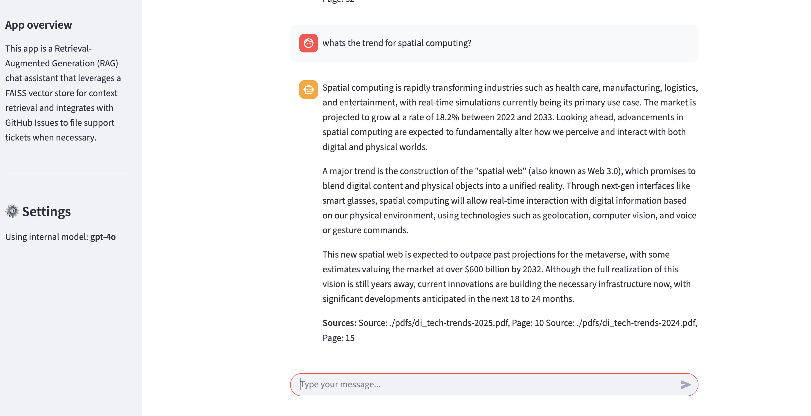
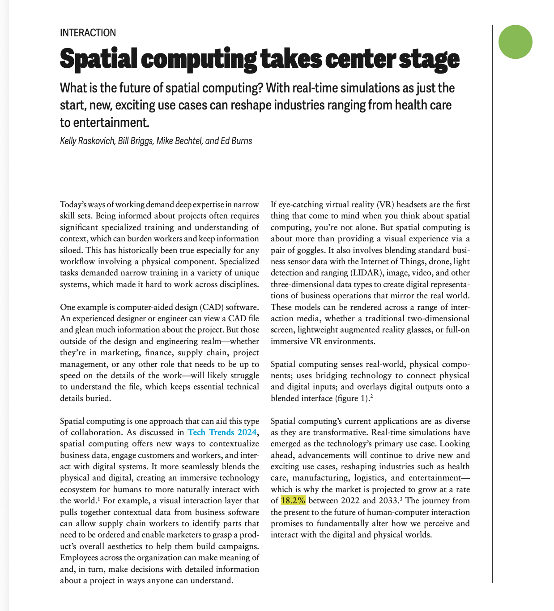

# Advanced Generative AI **Capstone Project III**

## Customer Support Solution: RAG Chat Assistant

### Objective

Build a Customer Support solution able to answer questions and raise support tickets.

---

## Features

- **Conversational Web Chat**: Users can ask questions and receive answers from a knowledge base built from multiple documents.
- **Support Ticket Integration**: If an answer is not found, the system suggests creating a support ticket. Users can instruct the system to create a ticket directly from the chat.
- **Support Ticket Details**: Tickets include user name, email, summary (title), and a detailed description.
- **Issue Tracking System**: Support tickets are filed into GitHub Issues (can be adapted for Jira/Trello).
- **Source Citation**: When answering from data, the system cites the document and page (e.g., "toyota-hilux.pdf, page 42").
- **Conversation History**: The chat maintains conversation history and keeps all messages in the context window.
- **Company Knowledge**: The AI assistant knows about the company, including name and contact information (phone/email).

---

## Data

- Uses at least 3 documents as data sources

---

## Technical Stack

- **Language**: Python
- **Interface**: Streamlit Web UI
- **Vector Store**: FAISS
- **Function Calling**: Supported (for ticket creation, etc.)
- **Dependencies**: See `requirements.txt`
- **Python Version**: See `requirements.txt` or project setup

---

## Deployment

- Hosted on HuggingFace Spaces
- [App Link](https://huggingface.co/spaces/yankuzin/itpu)

---

## Usage

1. Launch the app (locally or on HuggingFace Spaces)
2. Ask questions in the chat about the knowledge base
3. If the answer is not found, create a support ticket via chat
4. Tickets are filed to GitHub Issues with all required details

---

## File Structure

- `app.py` — Streamlit app entry point
- `agent.py` — Main agent logic
- `indexer.py` — Indexing and vector store logic
- `requirements.txt` — Python dependencies
- `pdfs/` — Source documents (PDFs and others)
- `faiss_index/` — Vector store files
- `src/` — Additional source code

---

## Contact

- For issues, contact via [Telegram: @beansandsoup](https://t.me/beansandsoup)

---

## Screenshots

This screenshot describes interaction with the app. The context in this case was obtained from the vector store based on the di_tech_trends-2025.pdf, a 72 page Deloitte's annual annual Tech Trend report.

