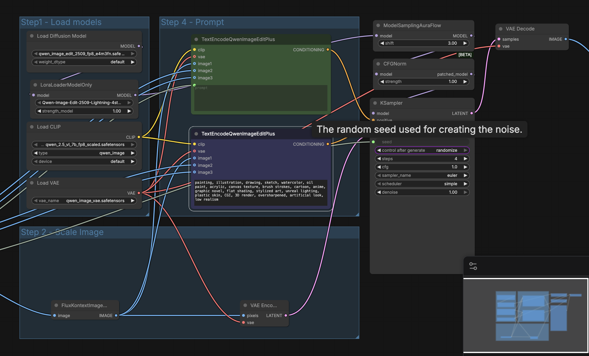
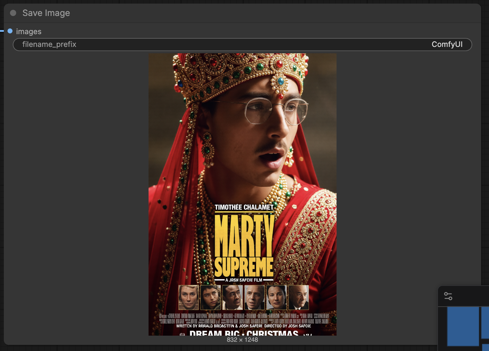

**Objective**

Design new covers for iconic media and document the self-hosted generation workflow and results.

**Original Work**

- Book: "An American Tragedy" (original illustrated cover used as reference)
- Movie: "Marty Supreme" (original poster used as reference)
- Album: "Whatever People Say I Am, That's What I'm Not" (Arctic Monkeys – original album cover used as reference)

**AI-Generated Work (variants produced)**

- Book cover variation — photorealistic cinematic reinterpretation of the original illustrated cover.
- Movie poster variation — Bollywood-inspired poster variant for the original movie poster.
- Album cover variation — stylized Simpson-like reinterpretation of the original album artwork.

Files with the generation workflows (templates and exact node setup):

- [workflows/BookCover.json](workflows/BookCover.json)
- [workflows/MovieCover.json](workflows/MovieCover.json)
- [workflows/AlbumCover.json](workflows/AlbumCover.json)

**Model & Assets Used**

- Diffusion model: `qwen_image_edit_2509_fp8_e4m3fn.safetensors` — source: Comfy-Org/Qwen-Image-Edit_ComfyUI (see workflow notes)
- Text encoder (CLIP): `qwen_2.5_vl_7b_fp8_scaled.safetensors` — Comfy-Org/Qwen-Image_ComfyUI
- VAE: `qwen_image_vae.safetensors`
- LoRA: `Qwen-Image-Edit-2509-Lightning-4steps-V1.0-bf16.safetensors` (used to enable high-quality results with very few sampling steps)

Model links referenced inside the workflows:

- qwen image edit template and model links: https://huggingface.co/Comfy-Org/Qwen-Image-Edit_ComfyUI
- Qwen-Image_ComfyUI: https://huggingface.co/Comfy-Org/Qwen-Image_ComfyUI

**Technical Generation Details**

- Generation frontend: ComfyUI (self-hosted). The project uses the provided JSON workflow templates above which instantiate the same node graph used for generation.
- Sampler: `KSampler` with `sampler_name` = `euler` (widget shows `euler`).
- Steps: `4` (the template uses a Lightning 4-steps LoRA to obtain good results with minimal steps).
- CFG / Guidance scale: `1.0` (the template uses a low CFG when paired with the LoRA).
- Scheduler: `simple` (per the KSampler widget in the workflow)
- Denoise: `1.00`
- Seed: the node uses `randomize` by default in the templates; the workflow captures seed widget for reproducibility if needed.
- Model patching: `CFGNorm` and `ModelSamplingAuraFlow` nodes are used to patch and sample the model with LoRA applied.
- Image scaling: `FluxKontextImageScale` used to prepare input reference images.

**Prompts Used**

- Album (AlbumCover.json prompt):

  Reimagine the Artic Monkey album "Arctic Monkeys Whatever People Say I Am, That's What I'm Not", high quality, simpson style

- Book (BookCover.json prompt):

  Reimagine the book cover “An American Tragedy” as a photorealistic cinematic scene, faithfully based on the original illustrated cover composition. Transform the drawn characters into real human beings with natural skin texture, realistic facial features, and lifelike expressions.

  The scene feels like a real moment frozen in time, with authentic lighting, depth, and atmosphere. Subtle environmental details such as realistic shadows, film-like contrast, and natural imperfections make the image feel photographed, not painted.

  Dramatic but believable lighting, shallow depth of field, realistic fabric textures, real-world proportions, cinematic realism, ultra-detailed, high fidelity, natural color grading, 35mm film look, sharp focus.

- Movie (MovieCover.json prompt):

  Reimagine the marty supreme movie poster, bollywood inspired, font is Sans-serif for all the names, for the main character on the cover add bollywood movie costume and decorations

**LoRAs / Adapters / Extensions**

- LoRA: `Qwen-Image-Edit-2509-Lightning-4steps-V1.0-bf16.safetensors` loaded via `LoraLoaderModelOnly` in the workflows and applied with strength `1`.
- No additional adapters beyond the CLIP text encoder / VAE referenced in the template.

**Pipeline / Configuration Screenshots**

- The workflows contain the exact node graph (the JSON files above are exports of the ComfyUI project). The template Markdown nodes list the model asset links and the node widgets show the sampler and KSampler settings.
- Example screenshots and node captures (these were used while running the workflows):
  - Sampler settings (KSampler widget showing `randomize`, `steps=4`, `cfg=1.0`, `sampler_name=euler`, `scheduler=simple`).
  - Model load nodes: `UNETLoader` `VAELoader` and `CLIPLoader` showing `qwen` model names.
  - Hardware / environment snapshot: the instance used shows `RTX 4090`, `16 vCPU`, `62 GB RAM`, `150 GB` container disk (this was the environment used to run ComfyUI in the supplied screenshots).

  These screenshots were captured from the running ComfyUI instance and are represented by the workflow JSON and captured images used as inputs (see node `LoadImage` widgets for the filenames used in runs).

  

**Resources & Hardware**

- Generation: ComfyUI (hosted with Podman) using the provided workflow templates in [workflows/](workflows)
- Models: donwloaded in the ComfyUI `models/` folder per the workflow note structure.
- Hardware used during generation (from environment screenshots taken while running):
  - GPU: RTX 4090 (1x)
  - vCPU: 16
  - Memory: 62 GB
  - Container disk: 150 GB

**How to Reproduce (short)**

1. Install ComfyUI using Podman VM, choose image-2-image template and download required models into the `models/` subfolders as shown in the template note (diffusion_models, loras, vae, text_encoders).
2. Load the appropriate workflow JSON from [workflows/](workflows) into ComfyUI.
3. Prepare the reference image (if doing an image-edit flow) and set the `LoadImage` node to the file you want to edit.
4. Run the workflow. Optionally record the `seed` value (KSampler) if you want deterministic reproduction, otherwise leave `randomize` enabled.

## Examples:

# Music Band Album

-BEFORE

-AFTER

# Book

-BEFORE

-AFTER

# Movie

-BEFORE

-AFTER

